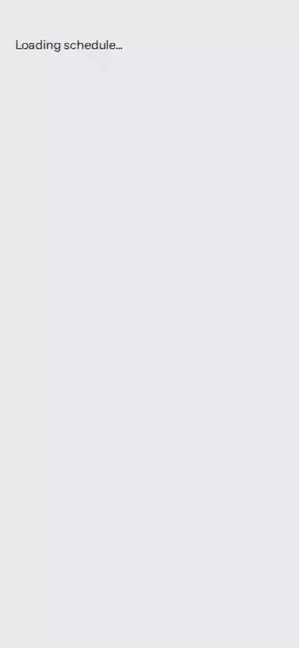
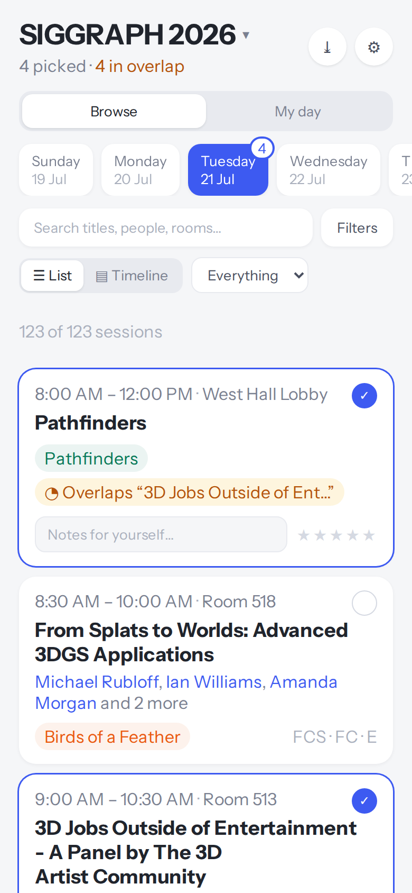
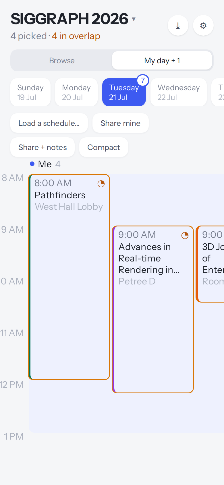
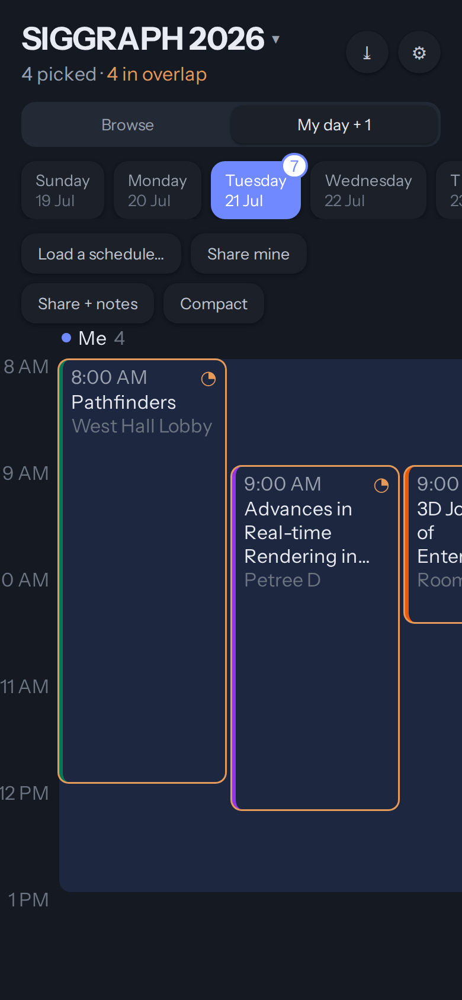

# SessionSamba

**Plan your conference days, offline.** Pick sessions, spot the overlaps,
compare schedules with colleagues, export to your calendar. No server, no
accounts, no tracking — everything stays on your device.

**[Open the app ›](https://greenwoodms06.github.io/SessionSamba/)** — install it
as a PWA and it keeps working on the show floor with no signal. First bundled
event: SIGGRAPH 2026 (487 sessions).

<p align="center">
  
</p>

| Browse & pick | Your day, side by side | Dark theme |
|---|---|---|
|  |  |  |

## What it does

- **Browse** one day at a time — filter by track, topic, room, or free text,
  with include *and* exclude ("everything except Posters" is a real query).
- **Pick sessions** — overlapping picks are flagged automatically.
- **Notes and ratings** on your picks, private to your device.
- **Compare schedules** — load a colleague's shared picks and see their day as
  a column beside yours on one time axis.
- **Export to calendar** (`.ics`) — re-exporting *updates* events instead of
  duplicating them.
- **Multiple events** — every conference keeps its own picks and notes; add
  new ones from a file or URL via the switcher (▾ in the header).

## Quick start

```bash
npm install
npm run dev          # http://localhost:5173
npm test             # 37 logic + 23 component tests
npm run build        # -> dist/

# Real-browser tests (Chromium via Playwright). First run only:
npx playwright install chromium
npm run test:e2e     # 23 end-to-end checks, starts its own server
```

Deploying is just pushing to `main` — the workflow tests, builds with the repo
name as base path, and publishes to GitHub Pages. For a custom domain set
`BASE_PATH=/`.

## Your data

Picks and notes live in IndexedDB on your device; the app requests persistent
storage and also writes a **backup file to your Downloads folder**, which no
browser evicts. Settings has "Back up now" and "Restore a backup…" — restoring
never overwrites newer local picks.

Nothing leaves your device unless you press a button:

| Action | Contains |
|---|---|
| **Share mine** | Session ids only, plus your display name |
| **Share + notes** | The above, plus your notes and ratings |
| **Calendar (.ics)** | Full session details, plus your notes |
| **Backup** | Everything, including trip metadata — for you, never shared |

A share file carries **ids, not a copy of the schedule** — the recipient
renders from *their* data, so retitles fix themselves and cancelled sessions
show as struck-through ghosts instead of silently vanishing. Trip metadata
(the journal's `x` block: hotels, flights) is **never** shareable; that code
path doesn't exist.

## Bring your own conference

SessionSamba is also a **portable schedule format** — [`SPEC.md`](SPEC.md) is
the definition, and any event that publishes two JSON files gets this whole
planner for free. A minimal session:

```json
{
  "id": "conf2027-my-stable-id",
  "day": "2027-05-04",
  "start": "14:00",
  "end": "15:30",
  "title": "A Session",
  "tracks": ["Papers"],
  "tags": []
}
```

Everything else (`location`, `url`, `contributors`, `access`, …) is optional —
absent blocks make their feature disappear cleanly. The one rule that matters:
**session ids must be stable and must not encode time or room**, because those
change right when people are building agendas (`SPEC.md` §2).

Check your data with the same rules the app applies at runtime:

```bash
npm run check:data                        # validate everything under public/data/
node scripts/check_bundle.mjs my.json     # or a single bundle file
npm run rebuild:index                     # refresh the manifest after adding a folder
```

Users can load your bundle by URL or file straight from the app's switcher —
no fork needed. To bundle it into this repo, add
`public/data/<id>/{config,sessions}.json` and rebuild the index.

## Testing

83 checks in three layers: pure-logic tests that also pin invariants on the
real 487-session dataset (a bad data change fails the build), every component
rendered against real data, and 23 real-Chromium e2e checks covering IndexedDB
persistence, the share round trip, backup restore, and offline via the service
worker.

Known gaps live in `SPEC.md` §11 — the notable ones are title-seeded topic
tags (54% coverage) and no physical iOS/Android pass yet.

## License

MIT.
